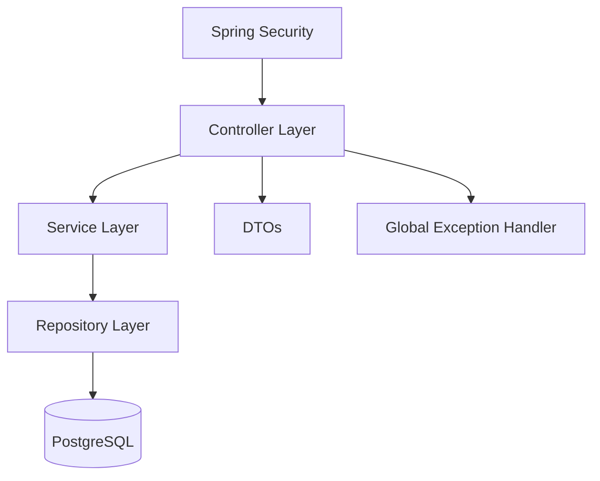
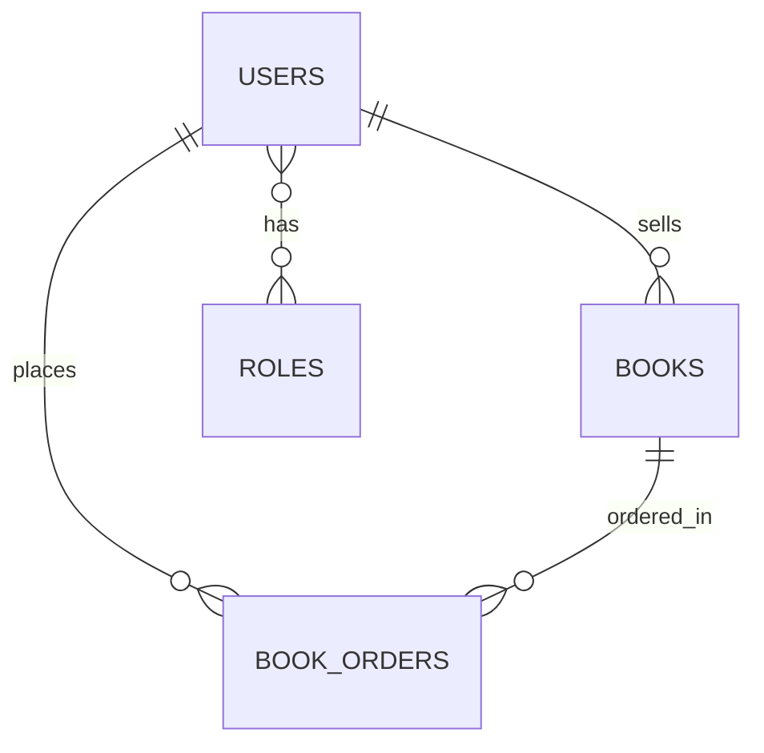

# Community Library Platform

A full-stack Spring Boot project designed to score strongly against the Software Engineering Lab Project rubric. It demonstrates layered architecture, Spring Security, DTO-driven REST APIs, PostgreSQL, Docker, GitHub Actions CI/CD, and Render deployment.

> This starter is aligned to the uploaded project guideline and the Community Library Platform theme.

## Project Theme
Community Library Platform with three roles:
- **ADMIN**: manages users, books, and order approvals
- **SELLER**: lists books
- **BUYER**: browses and orders books

## Tech Stack
- Spring Boot 3.5.11
- Java 21
- Thymeleaf
- Spring Security
- Spring Data JPA
- PostgreSQL
- Docker + Docker Compose
- GitHub Actions
- Render
- JUnit 5 + Mockito + MockMvc

## Architecture


## ER Diagram


## Core Entities
- `User`
- `Role`
- `Book`
- `BookOrder`

## REST API Endpoints
### Users
- `POST /api/users/register`
- `GET /api/users`
- `GET /api/users/{id}`

### Books
- `GET /api/books`
- `GET /api/books/{id}`
- `POST /api/books`
- `PUT /api/books/{id}`
- `DELETE /api/books/{id}`

### Orders
- `POST /api/orders`
- `GET /api/orders`
- `PATCH /api/orders/{id}/status?status=COMPLETED`

## Security Rules
- BCrypt password encoding
- Form login/logout
- Method-level authorization with `@PreAuthorize`
- URL-based access restrictions in `SecurityConfig`

## Branch Strategy
Create these branches in GitHub:
- `main`
- `develop`
- `feature/auth-security`
- `feature/books-module`
- `feature/orders-tests`
- `feature/devops-render`

Protect `main`:
- Require pull request before merge
- Require at least 1 approval
- Disable direct pushes
- Require status checks to pass

## Local Run
1. Copy `.env.example` to `.env`
2. Use Docker:
```bash
docker compose up --build
```
3. Open `http://localhost:8080`

Default seeded admin:
- email: `admin@bookexchange.com`
- password: `Admin@123`

## CI/CD
The workflow in `.github/workflows/ci-cd.yml`:
1. checks out code
2. sets up Java 21
3. runs `./mvnw clean verify`
4. triggers Render deploy hook on `main`

## Render Deployment
Two options:
1. **Blueprint deploy** using `render.yaml`
2. **Manual deploy** from GitHub repo using Docker runtime

Environment variables on Render:
- `SPRING_PROFILES_ACTIVE=prod`
- `SPRING_DATASOURCE_URL`
- `SPRING_DATASOURCE_USERNAME`
- `SPRING_DATASOURCE_PASSWORD`

Quick deploy checklist:
1. Push code to GitHub with `Dockerfile` and `render.yaml` in root.
2. In Render Dashboard: **New +** -> **Blueprint** -> connect repository.
3. Confirm `book-exchange-platform` web service and `book-exchange-db` database are detected.
4. Click **Apply** and wait for first build.
5. Open generated Render URL and test `/login`.

Notes:
- App runs on Java 21 (already configured in `pom.xml` and Docker image).
- Render passes the runtime `PORT` automatically; Docker entrypoint is already configured to use it.

## Testing Coverage Plan
This starter includes:
- **15+ service-layer unit tests** across user, book, and order services
- **3 integration tests** with `MockMvc`

## Demo Flow (5 minutes)
1. Show GitHub branches and PR history
2. Show Docker running app + database
3. Register buyer/seller
4. Seller creates book
5. Buyer places order
6. Admin approves/completes order
7. Show GitHub Actions pipeline
8. Show Render live app

## Important Notes Before Submission
- Replace the placeholder `mvnw` shell shim with the real Maven Wrapper from your IDE or Spring Initializr download.
- Add screenshots of branch protection, Actions success, and Render deployment in the README.
- Record at least one reviewed pull request to prove the workflow.
